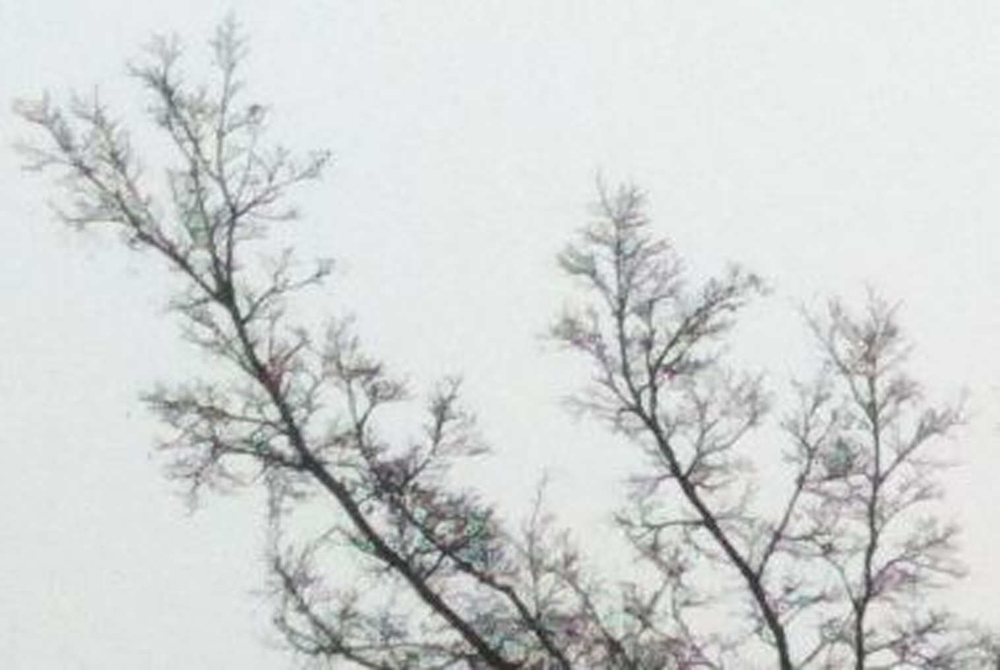
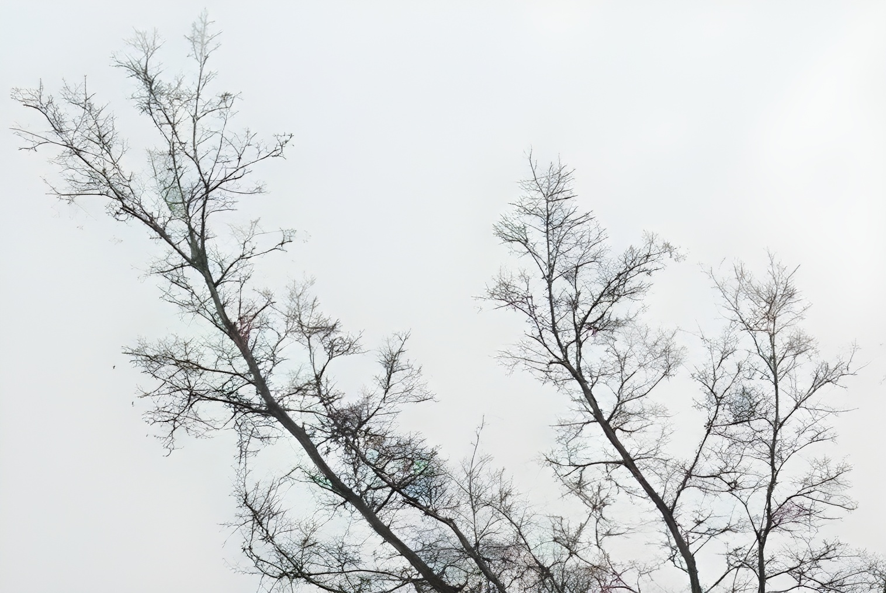

# Real_ESRGAN-PyTorch

## Table of contents

- [Real_ESRGAN-PyTorch](#real_esrgan-pytorch)
    - [Introduction](#introduction)
    - [Getting Started](#getting-started)
        - [Requirements](#requirements)
        - [Local Install](#local-install)
    - [All pretrained model weights](#all-pretrained-model-weights)
    - [Inference](#inference)
    - [Inference video](#inference-video)
    - [Train](#train)
    - [Result](#result)
    - [Contributing](#contributing)
    - [Credit](#credit)
        - [Real-ESRGAN: Training Real-World Blind Super-Resolution with Pure Synthetic Data](#real-esrgan-training-real-world-blind-super-resolution-with-pure-synthetic-data)

## Introduction

This repository contains an op-for-op PyTorch reimplementation of [Real-ESRGAN: Training Real-World Blind Super-Resolution with Pure Synthetic Data](https://arxiv.org/abs/2107.10833v2).

## Getting Started

### Requirements

- Python 3.10+
- PyTorch 2.0.0+
- CUDA 12.1+
- Ubuntu 22.04+

### Local Install

```bash
git clone https://github.com/Lornatang/Real_ESRGAN-PyTorch.git
cd Real_ESRGAN-PyTorch
pip install -r requirements.txt
pip install -e . -v
```

## All pretrained model weights

- [realesrnet_x4](https://github.com/Lornatang/Real_ESRGAN-PyTorch/releases/download/0.1.0/realesrnet_x4-df2k_degradation.pkl)
- [realesrgan_x4](https://github.com/Lornatang/Real_ESRGAN-PyTorch/releases/download/0.1.0/realesrgan_x4-df2k_degradation.pkl)
- [discriminator_for_unet_x4](https://github.com/Lornatang/Real_ESRGAN-PyTorch/releases/download/0.1.0/discriminator_for_unet_x4-df2k_degradation.pkl)

## Inference

```shell
# Download pretrained model weights to `./results/pretrained_models`
wget https://github.com/Lornatang/Real_ESRGAN-PyTorch/releases/download/0.1.0/realesrgan_x4-df2k_degradation.pkl -O results/pretrained_models/realesrgan_x4-df2k_degradation.pkl
python demo/inference_images.py configs/inference/images.yaml
# You will see
# Model summary: Params: 16.70 M, GFLOPs: 73.43 B
# SR image save to `demo/output/00003.jpg`
# SR image save to `demo/output/0030.jpg`
# SR image save to `demo/output/0014.jpg`
```

|                       Bicubic                        |                         Real_ESRGAN                          |
|:----------------------------------------------------:|:------------------------------------------------------------:|
|  |  |
|    |    |
|    |    |

## Inference video

```shell
# Download pretrained model weights to `./results/pretrained_models`
wget https://github.com/Lornatang/Real_ESRGAN-PyTorch/releases/download/0.1.0/realesrgan_x4-df2k_degradation.pkl -O results/pretrained_models/realesrgan_x4-df2k_degradation.pkl
# Download test demo video to `./demo`
wget https://github.com/ckkelvinchan/RealBasicVSR/blob/master/data/demo_001.mp4 -O demo/demo_001.mp4
python demo/inference_video.py configs/inference/video.yaml
# You will see
# Model summary: Params: 16.70 M, GFLOPs: 73.43 B
# Processing: 
# SR image save to `demo/output/demo_001.avi`

```

## Train

See [training.md](docs/training.md)

### Result

Source of original paper results: [https://arxiv.org/pdf/2107.10833v2.pdf](https://arxiv.org/pdf/2107.10833v2.pdf)

In the following table, the value in `()` indicates the result of the project, and `-` indicates no test.

|   Method   | Scale | Set5 (NIQE) | Set14 (NIQE) |
|:----------:|:-----:|:-----------:|:------------:|
| RealESRNet |   4   | -(**9.80**) | -(**7.08**)  |
| RealESRGAN |   4   | -(**7.09**) | -(**4.74**)  |

### Contributing

If you find a bug, create a GitHub issue, or even better, submit a pull request. Similarly, if you have questions,
simply post them as GitHub issues.

I look forward to seeing what the community does with these models!

### Credit

#### Real-ESRGAN: Training Real-World Blind Super-Resolution with Pure Synthetic Data

_Xintao Wang, Liangbin Xie, Chao Dong, Ying Shan_ <br>

**Abstract** <br>
Though many attempts have been made in blind super-resolution to restore low-resolution images with unknown and complex
degradations, they are still far from addressing general real-world degraded images. In this work, we extend the
powerful ESRGAN to a practical restoration application (namely, Real-ESRGAN), which is trained with pure synthetic data.
Specifically, a high-order degradation modeling process is introduced to better simulate complex real-world
degradations. We also consider the common ringing and overshoot artifacts in the synthesis process. In addition, we
employ a U-Net discriminator with spectral normalization to increase discriminator capability and stabilize the training
dynamics. Extensive comparisons have shown its superior visual performance than prior works on various real datasets. We
also provide efficient implementations to synthesize training pairs on the fly.
at [this https URL](https://github.com/xinntao/ESRGAN).

[[Paper]](https://arxiv.org/pdf/2107.10833v2.pdf) [[Author's implement(PyTorch)]](https://github.com/xinntao/Real-ESRGAN)

```bibtex
@InProceedings{wang2021realesrgan,
    author    = {Xintao Wang and Liangbin Xie and Chao Dong and Ying Shan},
    title     = {Real-ESRGAN: Training Real-World Blind Super-Resolution with Pure Synthetic Data},
    booktitle = {International Conference on Computer Vision Workshops (ICCVW)},
    date      = {2021}
}
```
